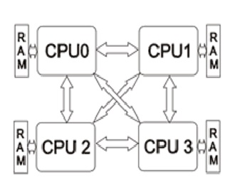

Каждый процессор имеет свою локальную память и более затратный доступ к памяти других процессоров.
Это **NUMA системы**, или *системы с неодинаковым доступом к памяти*. В NUMA cистемах каждый процессор имеет  
локальную память и при правильной привязке процессов к процессорам всегда используется «ближняя» память.
Доступ же в дальную память, с соответствующим пенальти происходит только при коммуникации процессов.
Если привязки процессов нет, то в результате так называемой _«миграции»_, процесс может быть запущен
на другом процессоре и работать со своими данными из дальней памяти.

Слайд 36
<!-- _footer: Архитектуры [Электронный ресурс]. URL: http://openmp.ru/2008/09/12/arxitektura-sovremennyx-superkompyuterov/ (дата обращения: 14.04.2020)-->